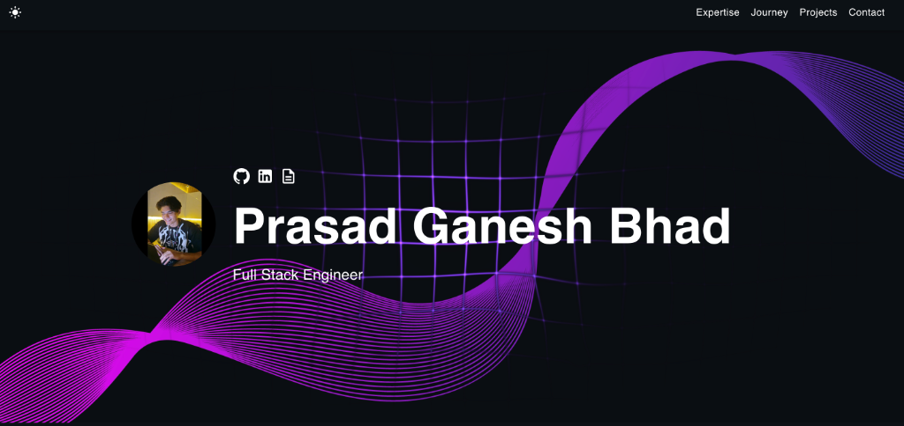

# Prasad Ganesh Bhad — Developer Portfolio 🚀

Welcome to my personal portfolio repository! I am a **Full Stack Engineer** and **Aspiring Cloud Engineer** focused on building secure, scalable distributed applications, cloud-native deployments, and interactive user experiences.

This repository hosts my responsive React + TypeScript portfolio, featuring custom interactive backgrounds, a detail-driven case-study engine, and real-time integration with GitHub metrics.

🔗 **Live Deployment**: [https://prasad-bug.github.io/react-portfolio-template](https://prasad-bug.github.io/react-portfolio-template)

---

## 📸 Portfolio Preview



---

## 🛠️ Tech Stack Highlights

*   **Frontend**: React, TypeScript, JavaScript, HTML5, CSS3, SASS / SCSS
*   **Backend & Networking**: Python, Node.js, Express.js, Flask, P2P Sockets
*   **DevOps & Infrastructure**: Docker, Kubernetes, Jenkins CI/CD, AWS (EC2, S3), Linux, Git
*   **Data Science & UI**: Streamlit, Jupyter Notebooks, Pandas

---

## 💻 Featured Projects

### 1. [EarthCore](https://github.com/prasad-bug/earthcore)
A full-stack, cloud-native application platform built to demonstrate enterprise-grade DevOps workflows and microservices orchestration.
*   **Core Concepts**: Containerized microservices, local orchestration, automated CI/CD pipelines, cluster hosting.
*   **Tech Stack**: Docker, Kubernetes (k8s manifests), Jenkins CI/CD, Docker Compose.
*   **How it Works**: Separates frontend and backend into decoupled services. The automated Jenkins pipeline triggers tests and builds on push, outputting production images deployed to a Kubernetes cluster for scale.

### 2. [ChatLink](https://github.com/prasad-bug/chatlink-p2p)
A decentralized, peer-to-peer (P2P) secure messenger built from scratch to guarantee end-to-end encryption and metadata privacy.
*   **Core Concepts**: Kademlia-style Distributed Hash Table (DHT) for peer lookup, end-to-end encryption, vector clocks.
*   **Tech Stack**: Python, Cryptography, Socket Programming, DHT.
*   **How it Works**: Peers discover and establish direct socket connections via a DHT without relying on a central server. Messages are secured using X3DH key agreement and the Double Ratchet encryption algorithm for forward secrecy.

### 3. [Discord-Scale Sharding Simulation](https://github.com/prasad-bug/Discord_Sharding)
A distributed systems project focused on benchmarking database sharding and data partitioning strategies under high concurrency.
*   **Core Concepts**: Horizontal scaling, consistent hashing, workload benchmarking, load distribution.
*   **Tech Stack**: Distributed Systems, Sharding Algorithms, Python, Benchmarking.
*   **How it Works**: Simulates high-concurrency traffic (resembling Discord chat channels) to measure read/write latency, hot-spot generation, and the impact of range-based vs. hash-based database sharding.

### 4. [LogiFly Smart Drone Analytics](https://github.com/prasad-bug/LogiFly-Drone-Analytics)
A data science case study and interactive dashboard analyzing the business ROI and operations telemetry of autonomous drone logistics.
*   **Core Concepts**: Telemetry ingestion, ROI modeling, feature engineering, interactive data visualization.
*   **Tech Stack**: Streamlit, Jupyter Notebooks, Python, Pandas.
*   **How it Works**: Ingests synthetic operations logs and applies financial modeling algorithms to calculate payback periods, drone battery efficiency, and operational bottlenecks. Outputs findings through an interactive Streamlit UI.

---

## ⚡ Quick Setup

To run this portfolio website locally:

1.  **Clone the repository**:
    ```bash
    git clone https://github.com/prasad-bug/prasad_portfolio.git
    cd prasad_portfolio
    ```

2.  **Install dependencies**:
    ```bash
    npm install
    ```

3.  **Configure environment variables**:
    Create a `.env` file in the root directory:
    ```env
    REACT_APP_EMAILJS_SERVICE_ID=your_service_id
    REACT_APP_EMAILJS_TEMPLATE_ID=your_template_id
    REACT_APP_EMAILJS_PUBLIC_KEY=your_public_key
    ```

4.  **Start the local development server**:
    ```bash
    npm start
    ```
    Open [http://localhost:3000](http://localhost:3000) to view it in your browser.

---

## 🚀 Build & Deployment

*   **Production Build**:
    ```bash
    npm run build
    ```
    This compiles and optimizes the project into static assets in the `build/` folder using code splitting and lazy loading.

*   **Deploy to GitHub Pages**:
    ```bash
    npm run deploy
    ```